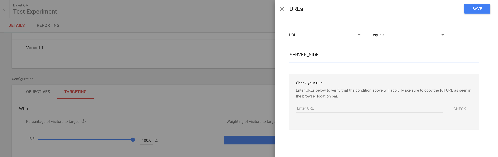
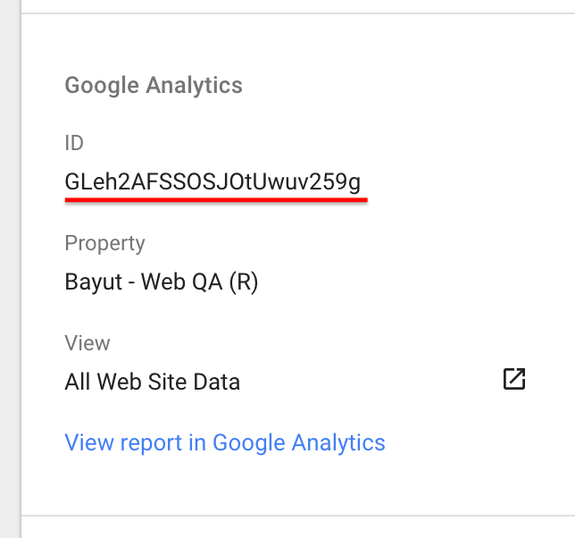
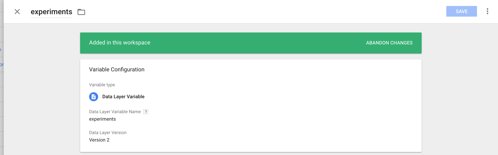
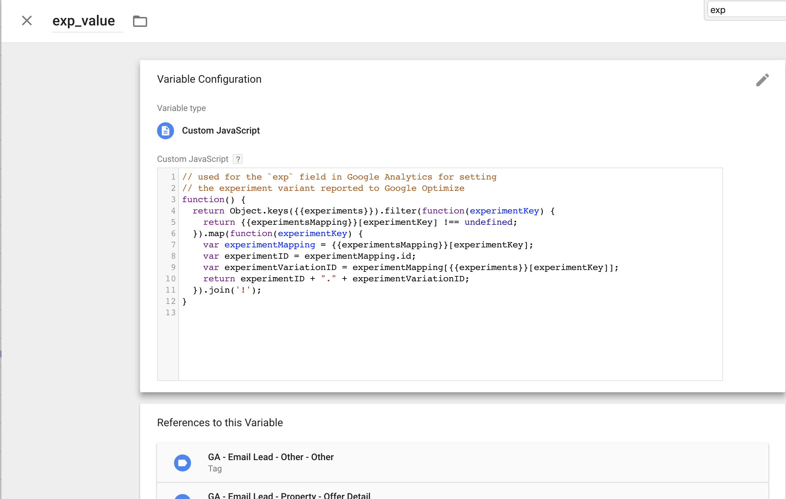
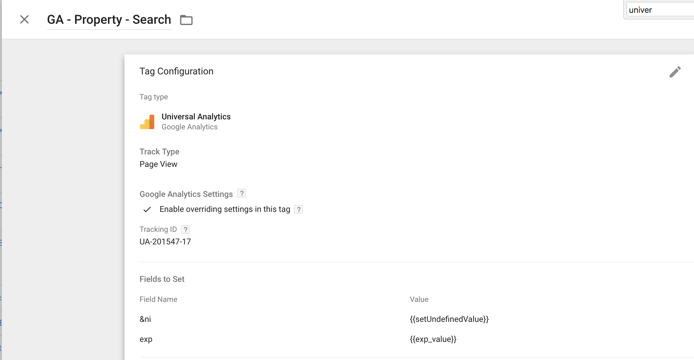

# Creating an experiment

1. Go to your Google Optimize account, to the container of the app you wish to create an experiment for.
2. Click **Create experiment**
3. Name it (e.g. `SearchBar Expanded/Collapsed`)
4. Provide a URL to the page you'd like to test. This URL seems to be completely ignored for server side experiments (which
we are using) so you can add any fictive URL here, but if you want to run a diagnostic, Google Optimize will use this URL.
If you're testing out locally, add the same fictive URL to your hosts file (e.g. `127.0.0.1  myhost.com`), set it as the `CANONICAL_DOMAIN`,
and run the app on port 80.
5. [Configure targeting](#targeting)
6. [Configure objectives](#objectives)
7. Add as many variants as you want.
8. Add the experiments in the `experiments/index.js` file of the project you're configuring experiments for
(e.g `explorer/experiments/index.js`). In the default export, add a new key with your experiment name,
the variations' names and weights (weights are optional and you don't need them if you want to split
the traffic equally). It should be similar to this:
```javascript
module.exports = {
    SearchBarTest: {
       variants: [{ name: 'original' }, { name: 'expanded' }],
    },
};
```
9. [Implement the experiment variants](#implementation)
10. [Map the experiment IDs in GTM](#gtmMapping).
11. [Add the `exp_value` GTM variable which encodes active experiment variations based on the dataLayer](#exp_value).
12. [Configure the GTM container for Google Optimize](#gtm).

# <a name="targeting">Targeting</a>

1. Go to the `Targeting` tab of the `Configuration` section of your experiment.
2. The percentage of visitors to target and weights of the experiment are unused (we're doing this server side).
3. Click `Create rule` -> `URLs`. Add a new rule: URL equals `SERVER_SIDE.`



# <a name="objectives">Objectives</a>

1. Go to the `Objectives` tab of the `Configuration` section of your experiment .
2. Click add `Add experiment objective`.
3. If you want to check `Bounces`, `Pageviews`, `Session Duration` or any other objective created in GA, 
click `Choose from list`.
4. Otherwise, if you want to add a custom event directly from Google Optimize, [create a custom objective](#customObjective)

**Note:** you can add up to three objectives for an experiment.

# <a name="customObjective">Create a custom objective</a>

An example objective which tracks favorites toggles will be configured in this section, but you can follow these steps
to track pretty much everything.

1. Go to the `Objectives` tab of the `Configuration` section of your experiment.
2. Click add `Add experiment objective`.
3. Click `Create custom`.
4. Name the objective: `Favorite toggles`.
5. Set the objective type to `Event`.
6. Add the proper rule for the custom objective: `Event Action` `Equals` `favourite_toggle`. Note that you should 
have autocomplete here, which (I'm guessing) is looking in the GTM container to check for available event names.
7. Optionally add a description to the event.
8. Set the counting method. In our case, this is `Many per session`.

# <a name="gtmMapping">GTM experiments mapping</a>

1. Go to the GTMs container variables list.
2. Create a new `Custom JavaScript` variable called `experimentsMapping`. Note that this variable might already be created. In this case, skip this step.
3. Add a new entry for the experiment. **The key of this entry should exactly match the one declared in your `experiments/index.js` file**. This entry should have the following attributes:
- `id`: this is the experiment id from the GO page (only available after you start the experiment).


- an entry with every available variation. The keys should match the ones defined in your `experiments/index.js`, and their values should be the the index of the variant in th
GO experiment dashboard (starting from zero).

For example, if you have an experiment with the ID `GLeh2AFSSOSJOtUwuv259g` and one variation (besides he original), and your `experiments/index.js` file looks like this:
```javascript
module.exports = {
    SearchBarTest: {
       variants: [{ name: 'original'}, { name: 'expanded' }],
    },
};
```
the `experimentsMapping` script should look like this:

```javascript
function() {
  return {
    SearchBarTest: {
      id: 'GLeh2AFSSOSJOtUwuv259g',
      original: 0,
      expanded: 1,
    },
  };
}
```


# <a name="exp_value">Adding a variable with the active experiment variations based on the dataLayer</a>

**Note:** this should only be done once per container, so these steps might not be needed.

1. Go to the GTM variables section. Add a dataLayer variable called `experiments`.



2. Go to the GTM variables section. Add a custom JavaScript variable called `exp_value`. Add the following code to it:

```html
// used for the `exp` field in Google Analytics for setting
// the experiment variant reported to Google Optimize
function() {
  return Object.keys({{experiments}}).filter(function(experimentKey) {
    return {{experimentsMapping}}[experimentKey] !== undefined;
  }).map(function(experimentKey) {
    var experimentMapping = {{experimentsMapping}}[experimentKey];
    var experimentID = experimentMapping.id;
    var experimentVariationID = experimentMapping[{{experiments}}[experimentKey]];
	return experimentID + "." + experimentVariationID;
  }).join('!');
}
```
It should look like this:



# <a name="gtm">Setting up Google Analytics tags to use the experiment information</a>
Since we're only using server-side experiments, the Google Optimize code is not needed on the browser-side, we just need
to tell Analytics which experiment is currently running. This happens via the `exp` field.

This should only be done once per container, so after the experiment, this won't be needed again.
1. Go to tags
2. Click each relevant Universal Analytics tag that is covered by the experiment objectives
3. Configure `Fields to Set` under `More settings` by adding the field `exp` with value `{{exp_value}}` (previously
created custom JavaScript GTM variable

This is how it should look like after you've added the `exp` field on a tag of interest:


# <a name="implementation">Implement the experiment variants</a>

We are using `react-redux-ab` which automatically decides what variant to serve and exposes this information in the redux store. You can use its `Experiment` and `Variant` components
to declaretively implement the experiment:

```js
import { Experiment, Variant } from 'react-redux-ab';

...

<Experiment name="SearchBarTest">
    <Variant name="original">
        <MiniSearchForm />
    </Variant>
    <Variant name="expanded">
        <MiniFormExpanded />
    </Variant>
</Experiment>

...
```
